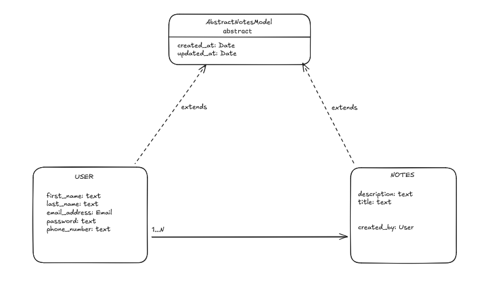
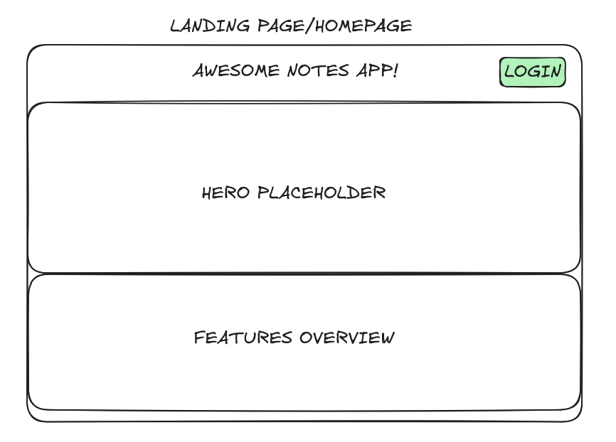
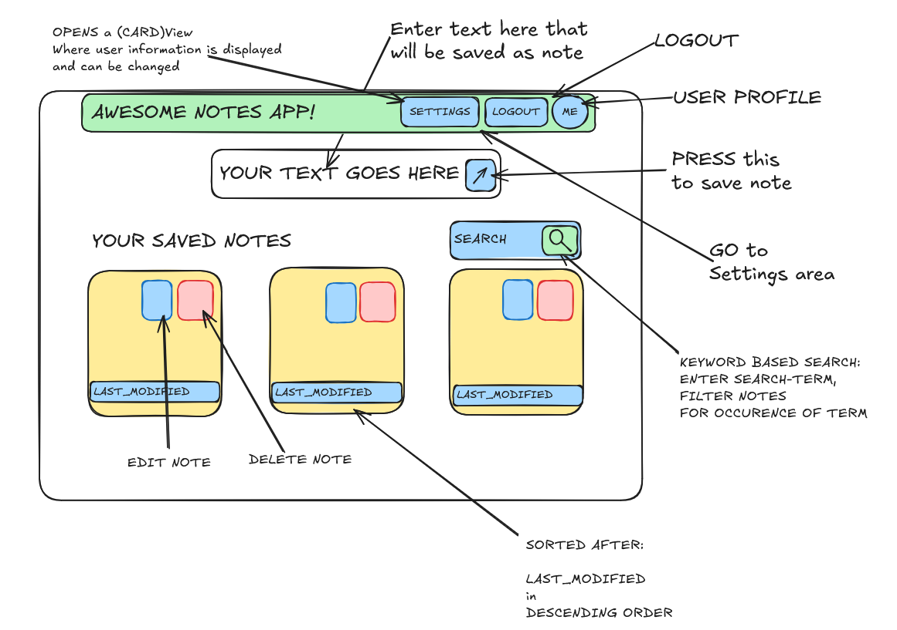

# Notes App Concept

This document contains basic documentation of the Application and its features.
It contains a schematic drawing of the main UI screens.

## Data Models

This section contains an overview about the identified Entities in the context of the system domain.

### `AbstractNotesModel`

A abstract django model, that includes the meta information properties like `created_at` or `updated_at`. All Other Models in the application will extend this abstract model implementation.

### `User`

A custom user implementation that extends from the `AbstractNotesModel` and djangos built-in `AbstractUser` model to inherit all required properties and benefit from djangos rich user-management implementation.
Implements an addiditional property for the `phone_number`.

### `Notes`

The model that represents the user made notes in the application.
Notes can have an optional title and they must contain a description/multi-line text which is the actual note.
Additional to the other meta fields a `Note` will also have a `ForeignKey`-Relation with users through the `created_by` property of the model.

## Screen Mockups

### Landing page

The landing page is the first touching point of the user with the application, therefore
the landing page should look appealing and interesting, so a user wants to spend time on the website or even use the notes application.

It should be explained what the application is about, how it works, and why to use this tool
over alternatives that are already existing.

### Managing Notes

This screen contains the main interaction users can do with the application:
It displays saved notes or allows the user to create new notes with different features.

**Key interactions:**
1. **Add new notes** - Users can enter text in the input field and save it as a note by pressing the save button
2. **View saved notes** - All created notes are displayed in a card-based layout, sorted by last modified date in descending order
3. **Edit notes** - Each note card includes an edit button to modify existing note content
4. **Delete notes** - Notes can be removed using the delete button on each card
5. **Search notes** - A keyword-based search feature allows users to filter notes by entering search terms

